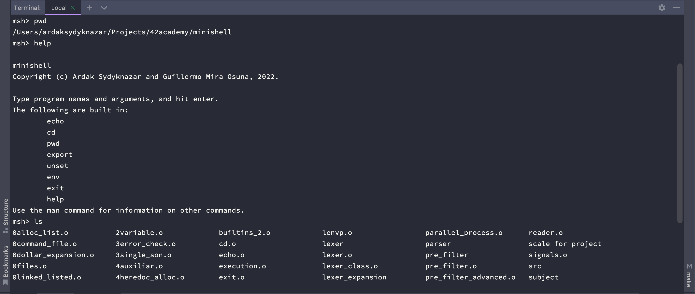

<h1 align="center">
	minishell
</h1>
<p align="center">
<b><i> :information_source: This project is part of my 42 programming academy cursus.</i></b><br>
<p>
<p align="center">
	
	
	
	
		
</p>
<p align="center">


</p>

<h3 align="center">
	<a href="#gear-about">About</a>
	<span> · </span>
	<a href="#warning-general-instructions">General instructions</a>
	<span> · </span>
	<a href="#rotating_light-mandatory-part">Mandatory part</a>
	<span> · </span>
	<a href="#link-links">Links</a>
	<span> · </span>
</h3>


***

## :gear: About
>The existence of shells is linked to the very existence of IT. At the time, all coders agreed that communicating with a computer using aligned 1/0 switches was seriously irritating. It was only logical that they came up with the idea to communicate with a computer using interactive lines of commands in a language somewhat close to english.
>
>With Minishell, we were able to travel through time and come back to problems people faced when Windows didn’t exist. 
>
>The objective of this project was to create a simple shell. Yes, own little bash or zsh. And learn a lot about processes and file descriptors.

## :page_with_curl: General instructions

To execute the program:
```console
git clone --recurse-submodules -j8 https://www.github.com/EarlyObject/42-minishell.git

cd 42-minishell/

make exe
```


## :rotating_light: Mandatory part
The shell should:

• Not interpret unclosed quotes or unspecified special characters like \ or;.

• Not use more than one global variable.

• Show a prompt when waiting for a new command.

• Have a working History.

• Search and launch the right executable (based on the PATH variable or by using relative or absolute path)

• It must implement the builtins:

  * echo with option -n

  * cd with only a relative or absolute path

  * pwd with no options 

  * export with no options

  * unset with no options

  * env with no options or arguments

  * exit with no options

• ’ inhibit all interpretation of a sequence of characters.

• " inhibit all interpretation of a sequence of characters except for $.

• Redirections:

  < should redirect input.

  > should redirect output.

  “<<” read input from the current source until a line containing only the delimiter is seen. it doesn’t need to update history!

  “>>” should redirect output with append mode.

• Pipes | The output of each command in the pipeline is connected via a pipe to the input of the next command.

• Environment variables ($ followed by characters) should expand to their values.

• $? should expands to the exit status of the most recently executed foreground pipeline.

• ctrl-C ctrl-D ctrl-\ should work like in bash.

• When interactive:

  ctrl-C print a new prompt on a newline.

  ctrl-D exit the shell.

  ctrl-\ do nothing.

***
## :link: Links 
*	[**minishell.eng.pdf**](subject/minishell.eng.pdf) - minishell subject in english
*	 [**minishell.es.pdf**](subject/minishell.es.pdf) - minishell subject in spanish